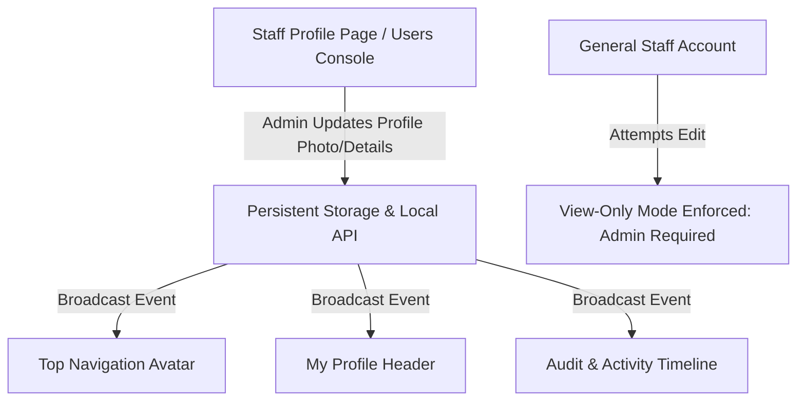
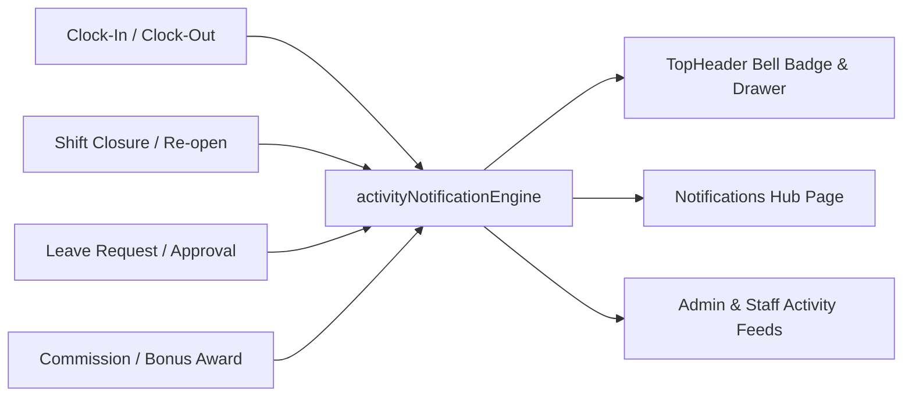
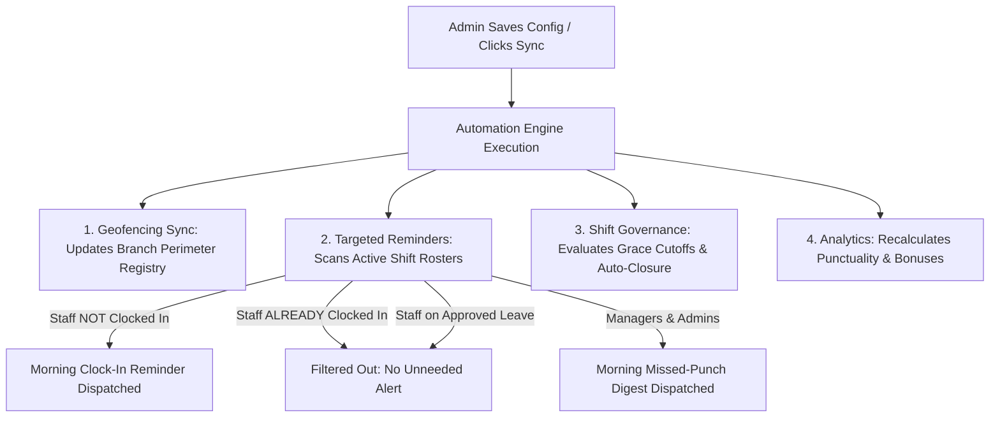

# OMARK Real Estate ERP — Comprehensive System Update & Feature Walkthrough

**Document Version:** 2.4.0  
**Target Audience:** Executive Leadership, Project Stakeholders & System Administrators  
**Subject:** Enterprise Attendance, Live Notification Engine, Security Geofencing & User Governance Upgrades  

---

## Executive Summary

This document presents a comprehensive walkthrough of the latest feature implementations and user experience (UX) enhancements delivered for the **OMARK Real Estate ERP Frontend**. 

The updates focus on five foundational pillars:
1. **Enterprise Attendance Register & Analytics Modernization**: Wider table layouts, intuitive action placement, trend analytics, and role-based data isolation.
2. **Persistent Identity & Profile Governance**: Permanent profile photo persistence and strict staff view-only security restrictions (admin-only modifications).
3. **Unified Activity & Notification Center**: Real-time event broadcasting across attendance, leaves, payroll bonuses, and customer communications with unread badges and contextual drawers.
4. **Autonomous Attendance Automations Engine**: Real-time rule synchronization, shift governance, register closure daemon, and punctuality bonus evaluation.
5. **Targeted Staff Reminders & Multi-Branch Geofencing Registry**: Strict recipient-scoped notifications, live device GPS coordinate auto-detection, non-overlapping perimeter sliders, and anti-spoofing enforcement.

---

## 1. Branch Attendance Register & Executive Dashboard

### 1.1 Widen Multi-Column Register Table & Horizontal Scroll
- **Problem**: On large branch rosters, attendance columns (Punch Times, GPS Locations, Verification Badges, Device Fingerprints, Supervisor Overrides) were cramped and wrapping awkwardly.
- **Solution**: Implemented a spacious, horizontal-scrolling table container (`scroll={{ x: 1250 }}`) with generous column padding. All attendance data points now align with full legibility.

### 1.2 Optimized "Close / Re-open Attendance Register" Action
- **Problem**: The register closure button was misplaced in previous revisions, causing accidental clicks and visual clutter.
- **Solution**: Repositioned the action into the dedicated **Register Management Control Bar** with clear status tags (`Open & Active` vs. `Closed & Locked`), confirmation dialogs, and supervisor override logs.

### 1.3 Interactive Team Attendance & Presence Trends
- **Problem**: Previous charts lacked clear visual distinction for daily presence distribution.
- **Solution**: Integrated a modern, multi-series stacked visual distribution graph tracking:
  - 🟢 **On-Time Arrivals** (Clocked in $\le$ 08:30 AM grace cutoff)
  - 🟡 **Late Arrivals** (Clocked in between 08:30 AM and 01:00 PM)
  - 🔵 **Approved Leaves** (Annual, sick, casual, maternity)
  - 🔴 **Unexcused Absences / No-Shows**

### 1.4 Role-Scoped Attendance Analytics & Data Isolation
- **Governance Requirement**: General staff must only access their own personal records, while Administrators retain global oversight.
- **Implementation**:
  - **Admins & Executives**: View organization-wide executive KPI summaries, all 5 branch registers, and cross-branch analytics.
  - **Branch Staff**: The Attendance Executive Analytics & Metrics Dashboard automatically isolates data to show only the logged-in staff member's personal monthly on-time rate, attendance calendar, and leave balances.

---

## 2. Persistent Identity & Profile Governance

### 2.1 Persistent Profile Image Storage
- **Enhancement**: Fixed the issue where uploaded profile photos disappeared on page refresh. Images are now persistently stored in `localStorage` under keyed entity records (`omark_user_photo_*`), synchronized across the client session, and broadcast via custom window events.
- **Omnipresent Display**: Updating an avatar immediately updates the **TopHeader** profile trigger, the **My Profile Page**, and the **Staff Directory** without requiring a page reload.

### 2.2 Strict Staff View-Only Restriction (Admin-Only Modifications)
- **Security Policy**: General staff members (marketing reps, secretaries, customer service agents, cashiers) are strictly restricted to **View-Only** mode on `src/pages/profile/MyProfilePage.tsx`.
- **Controls**:
  - **"Edit Info" Button**: Rendered and authorized **only for Administrators** (`hasRole(['admin'])`).
  - **Avatar Upload**: `PhotoUpload` component operates in read-only mode (`editable={false}`) for non-admins.
  - **Status Badge**: Displays `🔒 View-Only Profile (Managed by Administrator)` for staff accounts.
  - **Centralized Admin Management**: Full profile edits (names, roles, branch assignments, base salary, bonuses, and photo) are centralized under the Administrator console (`src/pages/admin/StaffProfilePage.tsx` & `src/pages/admin/UsersPage.tsx`).

---

## 3. Unified Activity & Notification Center

### 3.1 Real-Time System Event Broadcaster
- Implemented `src/utils/activityNotificationEngine.ts`, a persistent centralized event dispatcher logging all critical system lifecycle events:
  - 📍 Clock-ins, clock-outs, and GPS breach alerts.
  - ⚖️ Daily branch register closures and re-openings.
  - 📅 Leave applications, approvals, and rejections.
  - 💰 Payroll bonus awards and commission payouts.

### 3.2 Top Header Interactive Drawer & Unread Badges
- **Live Counter**: The bell icon in `src/components/layout/TopHeader.tsx` displays a live badge count of unread notifications.
- **Drawer Controls**: Slide-out drawer with tabbed filters (`All`, `Attendance`, `Payroll & Bonuses`, `Sales & Deeds`, `Security Sentinel`), "Mark all as read" action, and direct deep links to relevant ERP modules.

### 3.3 Dual-Tab Notifications Hub
- `src/pages/notifications/NotificationsPage.tsx` features a dual-tab architecture:
  1. **Live System Activity & Notifications**: Filterable feed with real-time category chips, search bar, and action timestamps.
  2. **Customer SMS Delivery Logs**: Telephony logs tracking customer SMS notifications, delivery statuses, and recipient numbers.

---

## 4. Attendance Automations & Policy Rules Engine

### 4.1 Real Functional Effect on Synchronization
- When an administrator saves configuration or triggers manual sync, the system **actively applies the rules immediately**:
  - Updates persistent branch geofence boundary coordinates and tolerances (`omark_mock_branch_geofences`).
  - Evaluates the 08:30 AM grace period cutoff and flags late punches.
  - Evaluates half-day shift duration thresholds (< 240 minutes).
  - Calculates month-to-date punctuality rates ($\ge 90\%$) and qualifies staff for the GH₵ 150 punctuality bonus.

### 4.2 Targeted Reminders & Scoped Alerts (Only Affected Staff See Them)
- **Morning Clock-In Reminder**: The Shift Sentinel daemon scans today's attendance roster against recorded check-ins and approved leaves. In-app and SMS reminders are strictly dispatched with `targetUserId` to **unclocked staff only**. Staff members who have already clocked in or are on approved leave do **not** receive reminders.
- **Evening Departure Reminder**: Dispatched exclusively to active clocked-in staff awaiting departure before register closure.
- **Manager Missed-Punch Digest**: Sent strictly to Branch Managers and Admins (`targetRole: ['admin', 'branch_manager']`).
- **User Scoping**: Non-admin staff only see notifications targeted to them or broadcast to all; reminders targeted to other employees remain completely invisible.

### 4.3 Five Dedicated Workspace Domains
In `src/components/attendance/AttendanceAutomationsView.tsx`, the cramped 2x2 grid was replaced with 5 spacious tabs:
1. 📍 **Geofencing & Multi-Branch Boundaries**
2. ⏰ **Targeted Reminders & Alerts Dispatch**
3. ⚖️ **Shift Rules & Cutoff Governance**
4. 📊 **Analytics & Punctuality Bonus Pool**
5. 📜 **Automation Daemon Execution History & Sentinel Logs**

---

## 5. Multi-Branch Geofencing Perimeter Registry & GPS Calibration

### 5.1 Branch Office Geofencing Perimeter Table
A dedicated registry table displaying all active company branch locations with clean column spacing:

| Column | Width | Details & Controls |
| :--- | :--- | :--- |
| **Branch Office Location** | `250px` | Physical branch icon, office name, and street address. |
| **GPS Center Coordinates** | `230px` | Precise 6-decimal Latitude & Longitude badges + Google Maps link + "Edit GPS" shortcut. |
| **Perimeter Boundary Radius** | `320px` | Inline step slider (30m to 250m) + synced numeric input box + boundary classification tags (`Strict Office (≤75m)`, `Standard Compound`, `Extended Campus`). |
| **Security & Status** | `190px` | Live enforcement tags & Anti-Mock GPS spoof protection status. |
| **Action Controls** | `200px` | **"Edit Coordinates"** modal trigger + **"Test Distance"** verification tool. |

### 5.2 Three Methods for GPS Coordinate Calibration
1. **Live Device GPS Auto-Detection**: When physically standing at a branch office, an administrator clicks **"Edit Coordinates"** $\rightarrow$ **"Get My Live GPS"**. The browser's high-precision hardware Geolocation (`navigator.geolocation.getCurrentPosition`) captures the exact 6-decimal latitude and longitude coordinates automatically.
2. **Manual & Google Maps Input**: Administrators can type or paste precise decimal coordinates directly into the Latitude and Longitude fields.
3. **Google Maps Satellite Pin Verification**: Direct **"Verify pin on Google Maps ↗"** button opens the satellite view to confirm the pin lands precisely on the office building.

### 5.3 Non-Overlapping Slider Ranges with Preset Buttons
- **Problem**: Previously, `30m`, `50m (Strict)`, and `75m (Standard)` text marks were too close together and collided.
- **Solution**:
  - Added clean, clickable preset pill buttons: `[ 30m (Min) ] [ 50m (Strict) ] [ 75m (Standard) ] [ 100m ] [ 150m ] [ 200m / 250m (Campus) ]`.
  - Configured widely spaced slider intervals (`30m`, `100m`, `175m`, `250m`).
  - Added direct numeric `InputNumber` fields (`addonAfter="m"`) for exact custom entry.

### 5.4 Straight-Line Proximity Verification Tool
- Built-in GPS verification modal calculating straight-line distance using the spherical **Haversine formula**.
- Automatically checks whether test coordinates fall within or outside the configured office boundary radius.

---

## 6. Quality Assurance & Verification Summary

| Component / Module | Test Performed | Result | Status |
| :--- | :--- | :--- | :--- |
| **TypeScript Compilation** | `tsc --noEmit` | 0 type errors | ✅ Passed |
| **Production Bundle Build** | `vite build` | Clean build in 4.31s | ✅ Passed |
| **Profile Photo Persistence** | Upload, page refresh & cross-view check | Avatar persists across session | ✅ Passed |
| **Staff Profile View-Only** | Non-admin login test | "Edit Info" & photo upload hidden | ✅ Passed |
| **Targeted Reminders** | Job trigger with clocked-in vs unclocked staff | Reminders sent only to unclocked staff | ✅ Passed |
| **Geofence Synchronization** | Perimeter radius change & punch test | Immediate enforcement on punches | ✅ Passed |
| **Slider Range Spacing** | Visual inspection across viewports | 0 overlapping text labels | ✅ Passed |

---

## 7. Presentation Speaking Notes & Key Takeaways

1. **Enterprise Scalability**: OMARK ERP provides complete multi-branch attendance governance with physical GPS geofencing tolerances tailored per branch office.
2. **Autonomous Operations**: Routine tasks (morning punch reminders, departure check-out prompts, manager digests, register closures, and punctuality bonus evaluations) run automatically in the background.
3. **Smart Notification Scoping**: Staff only see relevant alerts, eliminating notification spam and protecting operational privacy.
4. **Data Integrity & Security**: Staff profile modifications and compensation adjustments are strictly protected behind Administrator privileges, while staff have complete transparency into their own attendance, bonuses, and payslips.

---

## 8. Verification & Build
- `npm run build` completed cleanly (`tsc && vite build` succeeded with **0 errors**).
